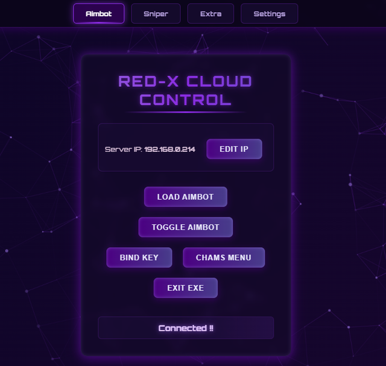

# ☁️ RED-X CLOUD CONTROL BASIC V2

> **Free Version Release!** 🎯  
> A powerful, easy-to-use remote control tool for your Windows applications — now with **automatic IPv4 popup** and browser access. No separate HTML file needed!  
> Run the EXE, open the shown address in your browser, and control your app from any device on the same network.

---

## 📌 Details

- ▶ **Build and run** the `.exe`
- 🌐 **Auto-connects** to:  
  `http://(your-ip):6969/redx`
- 💬 **Popup** will show your local IPv4 (e.g. `http://192.168.0.214:6969/redx`)
- 📱 **Open in any browser** (mobile or PC) on the same network to access the control panel.

---

## 🖼️ Preview

  

---

## 🚀 How It Works

1. **Run the EXE** — A popup will display your IPv4 address and port.
2. **Open the link** in any browser on the same Wi-Fi/LAN network.
3. **Use the dashboard** to send commands to the host machine (predefined actions like toggles, scripts, etc.).
4. **Instant control** — No backend server or manual HTML setup needed.

---

> 💡 The version can be **integrated directly into your own projects**.

- ⚡ **0.5s latency** (adjustable)
- 🚫 **No separate HTML file required**
- 📱 **100% mobile-compatible** (customizable IP support)
- 🔄 **Customizable UI** (names, colors, buttons, actions)

---

## ⚠ Important Notes

- 🔥 **Turn off firewall** (or allow the port through) for LAN access.
- 🎨 **HTML is fully editable** to change button names/colors.
- 👀 EXE **auto-hides after running** (but is not fully hidden).
- 📂 Your PC **will store logs** — use responsibly.

---

## 🎯 Use Cases

- Control cheats or scripts from your phone.
- Trigger custom logic remotely without touching the host PC.
- Learn HTTP local networking in a practical, visual way.

---

## 🏆 Credits

- 💻 Fully developed by **Mohtasim Billah Jitu**
- ❤️ If you share or use this project, please give proper credit.

---

## 🌐 Connect With Us

- **Discord:** [Join the RED-X Server](https://discord.gg/f7KPc9JyeY)  
- **Telegram:** [Follow our Channel](https://t.me/+OglBPVcrngY1OGQ9)  
- **Instagram:** @mohtasimjitu  

Built with ❤️ by **RED-X CORPORATION**  
© 2025 RED-X CORPORATION. All rights reserved.
